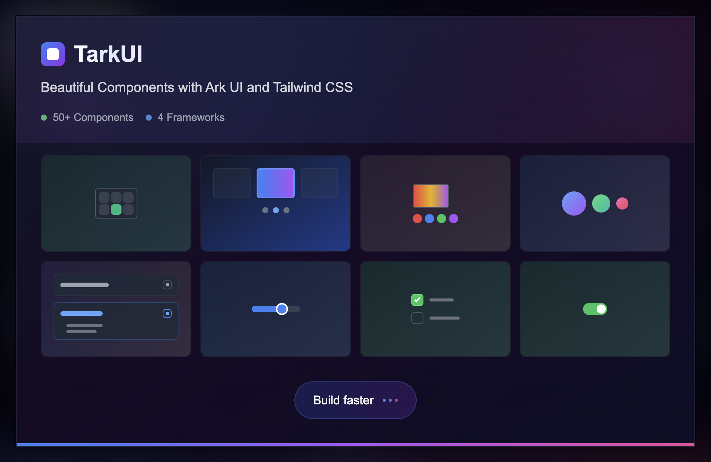

# Tark UI

Beautiful components built with Ark UI and Tailwind CSS. Tark UI provides a comprehensive set of accessible, customizable components that help you build modern web applications faster.

✨ **50+ Components** - A growing collection of components for common UI patterns
🎨 **Framework Agnostic** - Available for React, Vue, Solid and Svelte
🎯 **Type Safe** - Written in TypeScript with strong type definitions
📦 **Zero Dependencies** - Only peer dependencies on Ark UI, Tailwind CSS and Lucide Icons.
🌙 **Dark Mode** - Built-in dark mode support with smooth transitions
⚡ **Fast & Lightweight** - Optimized for performance and bundle size
